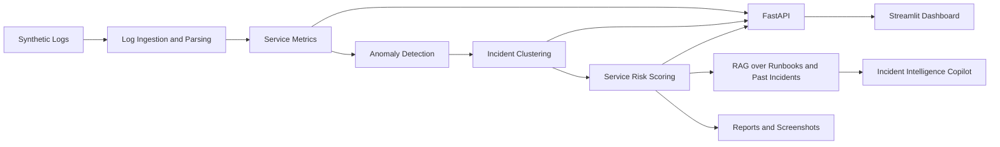
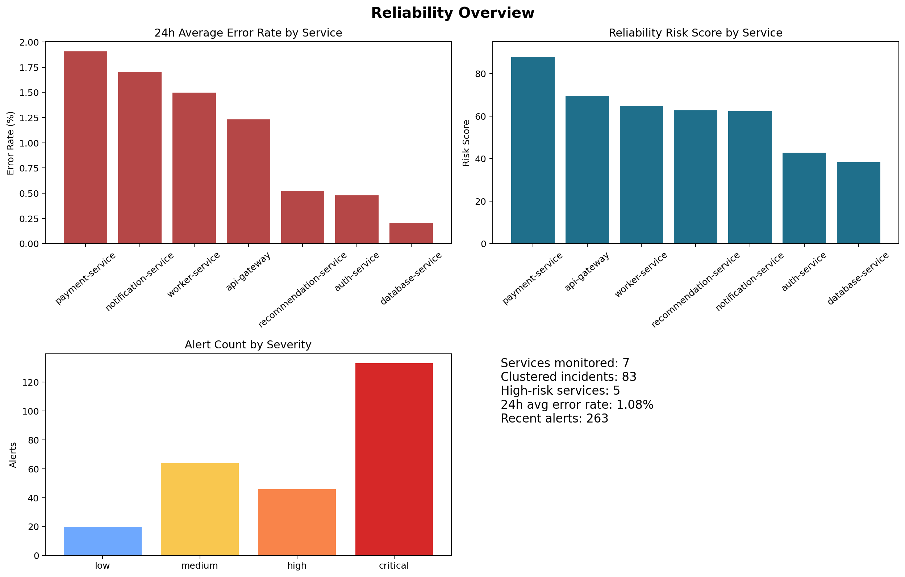
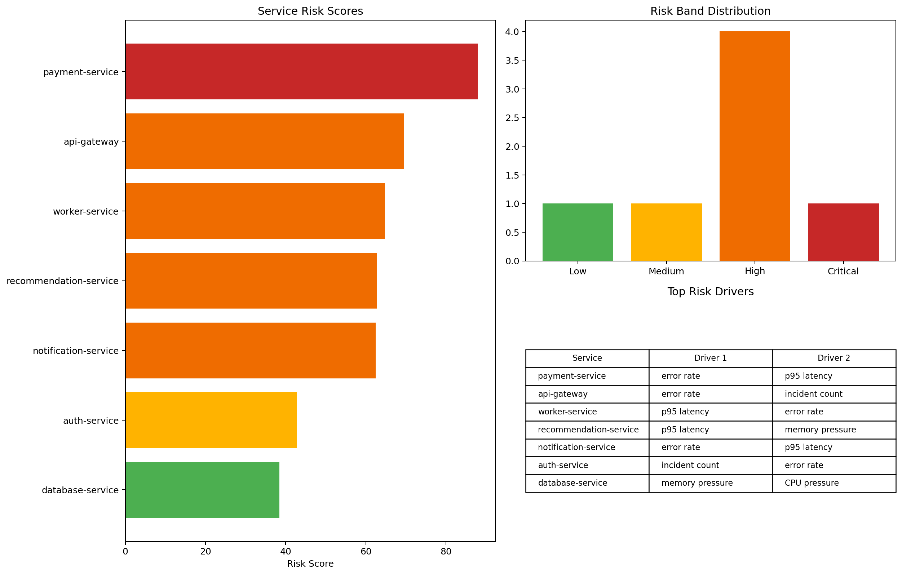
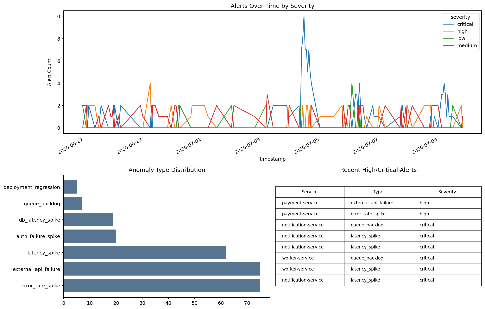

# AI Platform Reliability Copilot


AI Platform Reliability Copilot is a production-oriented prototype for AI-assisted reliability analytics, anomaly detection, root-cause recommendation, and incident intelligence. It is intentionally built on synthetic platform logs and simulated incidents so the repo stays honest, reproducible, and recruiter-friendly.

## Executive Summary

This project demonstrates how an AI engineering and platform reliability workflow can be structured end to end without overclaiming real production deployment. The system generates synthetic multi-service telemetry, converts logs into service-level metrics, detects anomalies, clusters incidents, scores service risk, retrieves relevant runbooks, and serves the outputs through FastAPI, Streamlit, and report artifacts.

## Recruiter Quick Scan

| Area | What This Repo Demonstrates |
| --- | --- |
| AI/ML | Isolation Forest anomaly detection, rolling statistical checks, TF-IDF retrieval |
| Backend | FastAPI contracts, CSV-backed service layer, local automation scripts |
| Reliability | Log ingestion, service KPIs, clustered incidents, risk scoring |
| Observability | Synthetic logs, deployment events, incident windows, evaluation reports |
| Portfolio Quality | Smoke tests, pytest, CI, Docker, screenshots, recruiter-friendly docs |

## Key Features

- Synthetic platform logs for seven services across four regions with correlated incident windows.
- Ingestion and data quality checks that produce hourly reliability metrics.
- Anomaly detection using Isolation Forest plus rolling z-score thresholds.
- Incident clustering with evidence summaries and next-step recommendations.
- Service risk scoring with Low, Medium, High, and Critical bands.
- TF-IDF retrieval over runbooks and incident history with a human-in-the-loop copilot.
- FastAPI endpoints and a local Streamlit dashboard backed by generated CSV outputs.

## Architecture



## Tech Stack

- Python 3.11
- FastAPI and Pydantic
- Streamlit
- Pandas and NumPy
- scikit-learn
- Matplotlib
- pytest

## Dataset Design

The synthetic dataset includes:

- `data/raw/platform_logs.csv`
- `data/raw/deployment_events.csv`
- `data/raw/known_incidents.csv`

Each log record includes timestamp, service name, environment, log level, request and trace identifiers, endpoint, status code, latency, error type, message, CPU, memory, DB latency, queue lag, region, and deployment version.

## Pipeline Workflow

1. `src/generate_synthetic_logs.py` creates correlated platform logs and incident ground truth.
2. `src/ingest_logs.py` validates and normalizes logs into hourly service metrics.
3. `src/detect_anomalies.py` scores anomalies and emits reliability alerts.
4. `src/incident_clustering.py` groups nearby alerts into incidents.
5. `src/service_risk_scoring.py` calculates service-level risk scores.
6. `src/retrieval.py` and `src/copilot.py` retrieve relevant context and produce structured responses.
7. `src/evaluate_system.py` writes evaluation artifacts and summary metrics.

## Methodology

### ML and anomaly detection

- Isolation Forest runs on hourly service metrics.
- Rolling z-scores watch latency, error rate, memory, CPU, DB latency, and queue lag.
- Alerts are enriched with suggested investigation areas for human operators.

### RAG and copilot

- TF-IDF retrieval searches markdown runbooks and incident records.
- Copilot answers are template-generated to avoid paid API requirements.
- Output framing is explicit about synthetic data and human review requirements.

## Screenshots





The screenshot set is generated from recalibrated outputs with validation checks to prevent empty error-rate views and saturated risk-score charts.

## Verified Local Run Status

The intended verification commands are:

```powershell
python -m compileall src api tests
python -m src.validate_outputs
python -m src.smoke_test
pytest tests -q
```

See `PROJECT_STATUS.md` for the most current verified state.

## Quickstart

```powershell
python -m venv .venv
.\.venv\Scripts\Activate.ps1
pip install -r requirements.txt
python -m src.smoke_test
python -m uvicorn api.main:app --host 0.0.0.0 --port 8000
python -m streamlit run dashboard/app.py
```

## API Usage

- `GET /health`
- `GET /kpis/overview`
- `GET /services/health`
- `GET /services/high-risk`
- `GET /anomalies/recent`
- `GET /incidents/recent`
- `GET /incidents/{incident_id}`
- `POST /copilot/ask`
- `POST /incidents/summarize`
- `POST /predict/service-risk`

## Dashboard Usage

The Streamlit dashboard includes:

- Overview
- Service Health
- Anomaly Detection
- Incident Timeline
- Root Cause Analysis
- Copilot Assistant
- Model Evaluation

## Repository Structure

```text
ai-platform-reliability-copilot/
├── api/
├── assets/
├── dashboard/
├── data/
├── reports/
├── runbooks/
├── scripts/
├── src/
├── tests/
├── .github/workflows/ci.yml
├── docker-compose.yml
├── Dockerfile
├── DEMO.md
├── PROJECT_STATUS.md
├── README.md
└── RESUME_BULLETS.md
```

## Reports

- `reports/model_evaluation.md`
- `reports/incident_analysis_report.md`
- `reports/root_cause_analysis.md`
- `reports/model_card.md`
- `reports/responsible_ai_notes.md`
- `reports/architecture.md`

## Supported Resume Claims

- Production-oriented prototype for AI-assisted reliability analytics.
- Synthetic incident intelligence workflow spanning ingestion, anomaly detection, retrieval, and API delivery.
- Human-in-the-loop root-cause recommendation and service risk scoring.
- Recalibrated output validation to prevent saturated scoring and empty observability charts.

## Limitations

- Uses synthetic platform logs rather than real production telemetry.
- Evaluation is approximate because synthetic ground truth is used.
- No real cloud deployment, enterprise auth, or distributed streaming stack is claimed.

## Future Improvements

- Add optional vector search persistence.
- Add browser-based screenshot capture.
- Ingest OpenTelemetry-formatted traces and metrics.
- Expand evaluation datasets and retrieval labels.
