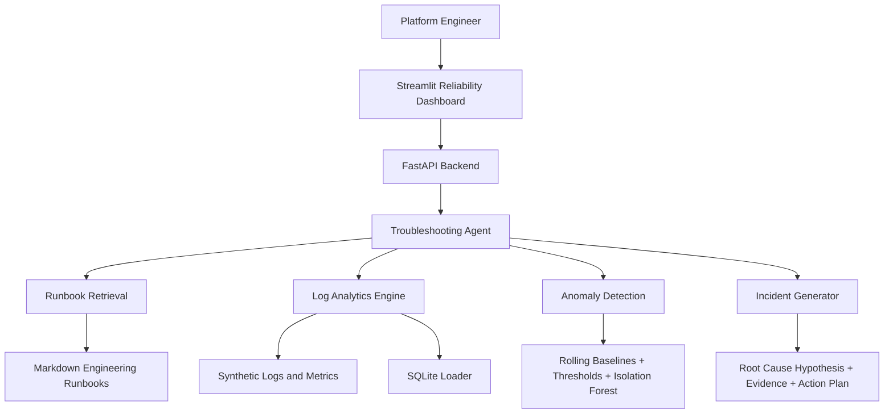

# AI Platform Reliability Copilot


An internal AI engineering assistant for platform teams. It uses runbook retrieval, tool-style agent workflows, log analytics, anomaly detection, and incident-summary generation to help engineers debug backend service issues faster.

This project is built as a production-style AI platform portfolio project, not a notebook demo. It is aligned with AI engineering, backend engineering, platform reliability, and MLOps workflows used by cloud and developer-platform teams.

## Why This Project Exists

Platform engineers often lose time moving between runbooks, logs, dashboards, deployment history, and incident notes. This copilot brings those signals into one workflow:

- Search engineering runbooks with source-grounded retrieval.
- Analyze synthetic production-style logs and service metrics.
- Detect latency, error-rate, CPU, memory, timeout, and traffic anomalies.
- Correlate failures with service, region, and deployment version.
- Generate incident summaries, evidence, and recommended actions.
- Expose the system through FastAPI and a Streamlit dashboard.

## Demo Scenario

The strongest built-in demo is a `payment-service` degradation in `ap-south` after deployment `v2.1.4`.

The synthetic telemetry includes:

- Error rate rising from normal baseline to a high-risk incident slice.
- P95 latency rising from roughly `280 ms` to `1400+ ms`.
- Dominant error type: `DB_CONNECTION_TIMEOUT`.
- Elevated timeout count.
- Region and deployment metadata for root-cause correlation.

Example question:

```text
Why is payment-service failing in ap-south after deployment v2.1.4?
```

Example output:

```text
payment-service in ap-south is showing a DB_CONNECTION_TIMEOUT reliability pattern.
The riskiest slice is correlated with deployment v2.1.4 in ap-south.
Evidence includes elevated error rate, p95 latency regression, timeout count, and payment-service runbook guidance.
```

## Architecture



## System Workflow

1. A platform engineer asks a service reliability question in the dashboard or through `/chat`.
2. The FastAPI backend routes the request to the troubleshooting agent.
3. The agent retrieves relevant runbook context from markdown documents.
4. The log analyzer calculates error rates, latency summaries, top errors, and deployment-related failures.
5. The anomaly detector evaluates service metrics using rolling baselines, thresholds, and optional Isolation Forest.
6. The incident generator produces a summary, root-cause hypothesis, action plan, and postmortem template.
7. The response returns a concise answer with evidence, citations, and recommended actions.

## Key Features

| Area | What It Demonstrates |
| --- | --- |
| RAG over runbooks | Chunking, retrieval, source-grounded answers, fallback local search |
| AI agent workflow | Tool-style orchestration across docs, logs, anomalies, and incident summaries |
| Log analytics | Error-rate calculation, top error types, latency summaries, deployment correlation |
| Anomaly detection | Rolling statistics, threshold detection, optional Isolation Forest |
| Backend API | FastAPI, Pydantic schemas, REST endpoints, Swagger docs |
| Dashboard | Streamlit UI for chat, health, logs, anomalies, incidents, and sources |
| Cloud readiness | Dockerfile, docker-compose, Kubernetes manifests, GitHub Actions |
| Portfolio polish | Realistic synthetic data, runbooks, tests, architecture docs, resume bullets |

## Tech Stack

| Layer | Tools |
| --- | --- |
| Language | Python |
| Backend | FastAPI, Pydantic, Uvicorn |
| Frontend | Streamlit |
| Data | Pandas, NumPy, CSV, SQLite |
| ML / Analytics | scikit-learn, rolling statistics, z-score style thresholds, Isolation Forest |
| RAG | Markdown runbooks, local retrieval fallback, optional ChromaDB and sentence-transformers |
| DevOps | Docker, docker-compose, Kubernetes manifests, GitHub Actions |
| Testing | pytest, FastAPI TestClient |

## Repository Structure

```text
ai-platform-reliability-copilot/
|-- backend/
|   |-- api/
|   |-- database/
|   |-- models/
|   |-- services/
|   |-- utils/
|   `-- main.py
|-- frontend/
|   `-- app.py
|-- data/
|   |-- generate_synthetic_data.py
|   |-- synthetic_logs.csv
|   |-- service_metrics.csv
|   `-- incidents.csv
|-- knowledge_base/
|-- tests/
|-- k8s/
|-- notebooks/
|-- .github/workflows/
|-- architecture.md
|-- Dockerfile
|-- docker-compose.yml
|-- requirements.txt
|-- requirements-rag.txt
`-- README.md
```

## File-by-File Guide

| File / Folder | Importance |
| --- | --- |
| `backend/main.py` | FastAPI application entry point; registers routes, CORS, startup database loading, health and service endpoints. |
| `backend/api/chat.py` | Defines `/chat`, the main copilot endpoint used by the Streamlit UI. |
| `backend/api/logs.py` | Defines `/analyze-logs` for service-level log summaries, error rates, top errors, latency, and deployment failures. |
| `backend/api/metrics.py` | Defines `/metrics/summary` and `/detect-anomalies` for dashboard KPIs and anomaly results. |
| `backend/api/incidents.py` | Defines `/incident-summary` and `/feedback` for incident automation and user feedback capture. |
| `backend/models/schemas.py` | Pydantic request and response models for typed API contracts. |
| `backend/services/agent_service.py` | Orchestrates the copilot workflow across retrieval, logs, anomalies, and incident generation. |
| `backend/services/rag_service.py` | Loads markdown runbooks, chunks content, retrieves relevant source snippets, and provides fallback RAG answers. |
| `backend/services/log_analyzer.py` | Reads synthetic logs and computes error rates, latency summaries, top error types, and deployment-related failures. |
| `backend/services/anomaly_detector.py` | Detects abnormal latency, error rate, CPU, memory, traffic, and timeout behavior. |
| `backend/services/incident_generator.py` | Generates incident summaries, root-cause hypotheses, action plans, and postmortem templates. |
| `backend/database/db.py` | Loads CSV telemetry into SQLite for SQL-backed extension while preserving CSV fallback behavior. |
| `backend/utils/config.py` | Centralizes paths, environment variables, and runtime settings. |
| `frontend/app.py` | Streamlit dashboard with tabs for copilot chat, service health, logs, anomalies, incidents, and RAG sources. |
| `data/generate_synthetic_data.py` | Generates realistic service logs, metrics, and incidents, including the payment-service demo incident. |
| `data/synthetic_logs.csv` | Synthetic application logs with service, region, status code, latency, error type, deployment version, and trace metadata. |
| `data/service_metrics.csv` | Synthetic metric time series for latency, error rate, CPU, memory, request count, and timeout count. |
| `data/incidents.csv` | Example incident records used for portfolio realism and future extension. |
| `knowledge_base/*.md` | Engineering runbooks used as RAG source material. |
| `tests/*.py` | Unit and API tests for retrieval, anomaly detection, log analytics, incident generation, and FastAPI endpoints. |
| `k8s/*.yaml` | Basic Kubernetes deployment and service manifests for backend and frontend. |
| `.github/workflows/ci.yml` | GitHub Actions workflow that installs dependencies, generates data, and runs tests. |
| `Dockerfile` | Container image definition for running the project in a reproducible environment. |
| `docker-compose.yml` | Runs backend and frontend together for local containerized development. |
| `requirements.txt` | Core dependencies for reliable Windows/local execution. |
| `requirements-rag.txt` | Optional heavier RAG dependencies for ChromaDB and sentence-transformers. |
| `architecture.md` | Standalone architecture explanation and request flow. |

## API Endpoints

| Method | Endpoint | Purpose |
| --- | --- | --- |
| `GET` | `/health` | Confirms backend status and environment. |
| `GET` | `/services` | Lists monitored synthetic services. |
| `POST` | `/chat` | Runs the troubleshooting agent and returns answer, evidence, sources, and actions. |
| `POST` | `/analyze-logs` | Returns log volume, error rate, top errors, latency summary, and deployment failures. |
| `POST` | `/detect-anomalies` | Returns anomaly list and service health score. |
| `POST` | `/incident-summary` | Generates incident summary, root-cause hypothesis, action plan, and postmortem template. |
| `GET` | `/metrics/summary` | Returns service-level KPIs for the dashboard. |
| `POST` | `/feedback` | Captures a rating and comment for future feedback workflows. |

Sample `/chat` request:

```json
{
  "query": "Why is payment-service failing in ap-south after deployment v2.1.4?",
  "service_name": "payment-service",
  "region": "ap-south"
}
```

## Local Setup

Use Python from `python.org` rather than the Windows Store alias.

```powershell
cd "E:\EA project\ai-platform-reliability-copilot"
python -m venv .venv
.\.venv\Scripts\Activate.ps1
pip install -r requirements.txt
python data\generate_synthetic_data.py
```

Start the backend:

```powershell
python -m uvicorn backend.main:app --reload --host 0.0.0.0 --port 8000
```

Start the dashboard in a second terminal:

```powershell
cd "E:\EA project\ai-platform-reliability-copilot"
.\.venv\Scripts\Activate.ps1
python -m streamlit run frontend\app.py
```

Open:

- Streamlit dashboard: `http://localhost:8501`
- FastAPI docs: `http://localhost:8000/docs`
- Health check: `http://localhost:8000/health`

## Optional Enhanced RAG

The default app uses a lightweight local retrieval fallback so the project runs reliably on Windows without C++ build tools.

To experiment with heavier vector search dependencies:

```powershell
pip install -r requirements-rag.txt
```

On Windows, `chromadb` may require Microsoft C++ Build Tools because of `chroma-hnswlib`.

## Docker

```powershell
docker compose up --build
```

Then open:

- Backend: `http://localhost:8000`
- Frontend: `http://localhost:8501`

Docker is optional. The project runs locally without Docker.

## Testing

```powershell
python data\generate_synthetic_data.py
pytest -q
```

The test suite covers:

- RAG retrieval relevance.
- Payment-service anomaly detection.
- FastAPI health and chat endpoints.
- Log analyzer error-rate calculations.
- Incident summary generation.

## Interview Explanation

I built this as an AI platform reliability assistant for backend and platform engineers. It combines RAG over operational runbooks, tool-style agent orchestration, log analytics, anomaly detection, and incident-summary generation. The system lets an engineer ask a natural-language question about a failing service and returns a grounded answer with evidence from logs, metrics, deployment metadata, and runbooks.

The main demo is a payment-service degradation in `ap-south` after deployment `v2.1.4`, where DB timeout errors, p95 latency, error rate, and timeout count all point to a deployment-correlated reliability issue.

## Future Improvements

- Add OpenTelemetry ingestion for real traces, logs, and metrics.
- Persist vector search with ChromaDB or FAISS.
- Add RAG evaluation metrics and answer-quality scoring.
- Add role-based access control for internal platform teams.
- Integrate Slack or Microsoft Teams incident workflows.
- Deploy backend on Render and frontend on Streamlit Community Cloud.
