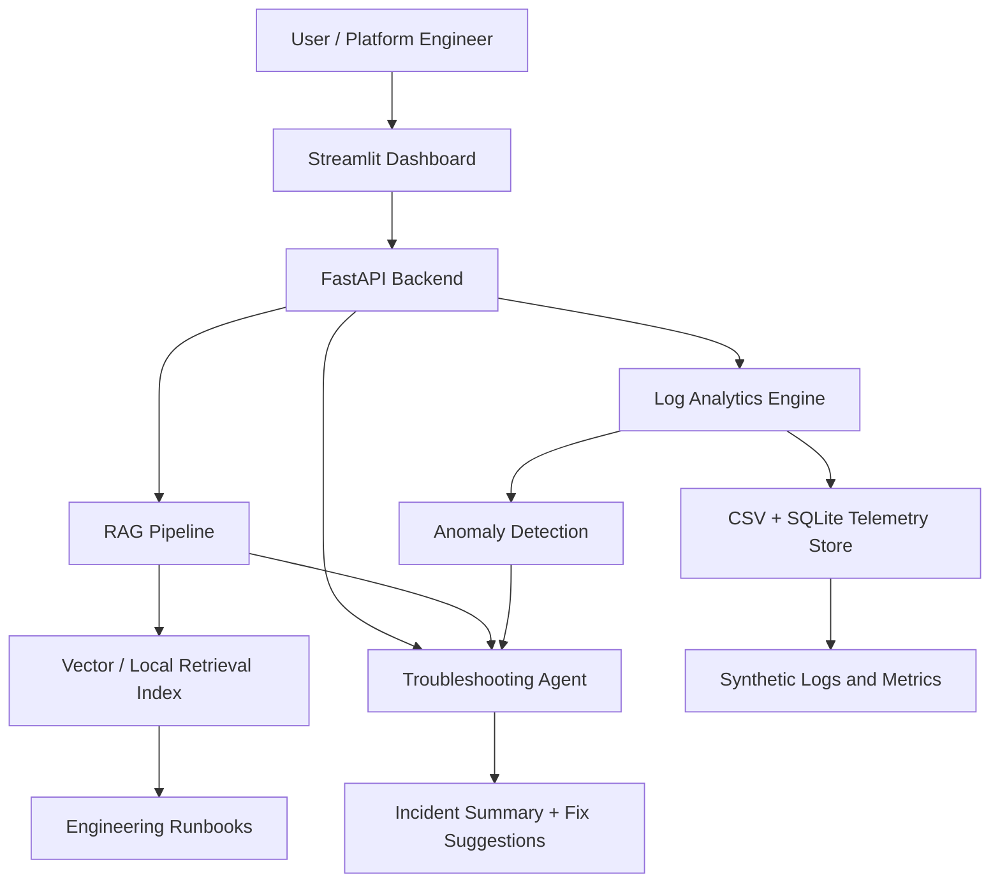

# Architecture

## Request Flow

1. The engineer asks a debugging question in Streamlit or calls `/chat`.
2. FastAPI sends the query to the troubleshooting agent.
3. The agent retrieves relevant runbook chunks from the RAG service.
4. The agent queries logs, latency summaries, error rates, and deployment failures.
5. The anomaly detector evaluates rolling baselines, fixed thresholds, and optional Isolation Forest output.
6. The incident generator produces root-cause hypotheses, recommended actions, and a postmortem template.
7. The response returns source-grounded evidence and operational next steps.

## Design Notes

- The project supports real LLM provider keys through environment variables, but defaults to deterministic fallback answers so the demo works without paid services.
- Synthetic data intentionally contains a payment-service incident in `ap-south` after deployment `v2.1.4`.
- CSV files are loaded into SQLite at startup for extension into SQL-backed analytics.
