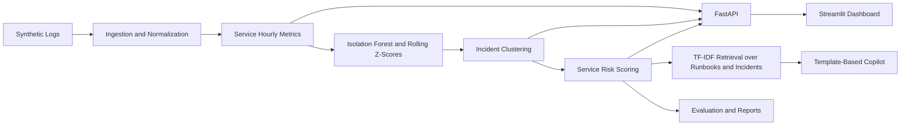

# Architecture

```mermaid
flowchart LR
    A["Synthetic Logs"] --> B["Ingestion and Normalization"]
    B --> C["Service Hourly Metrics"]
    C --> D["Isolation Forest and Rolling Z-Scores"]
    D --> E["Incident Clustering"]
    E --> F["Service Risk Scoring"]
    F --> G["TF-IDF Retrieval over Runbooks and Incidents"]
    G --> H["Template-Based Copilot"]
    C --> I["FastAPI"]
    E --> I
    F --> I
    I --> J["Streamlit Dashboard"]
    F --> K["Evaluation and Reports"]
```

This system is a production-oriented prototype designed for local execution with honest synthetic data constraints.
